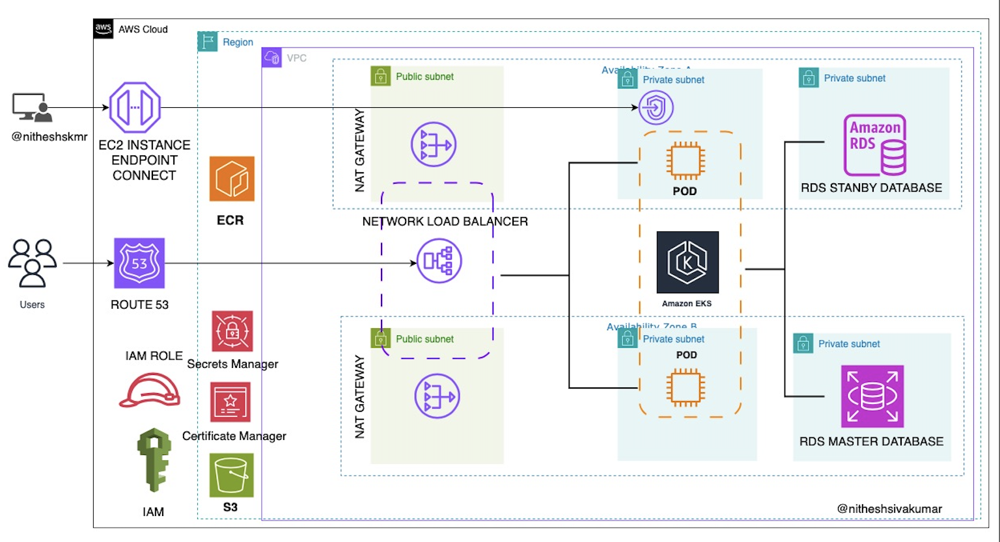

Kubernetes-based Deployment on AWS with Amazon EKS

## 📌 Project Overview

This project deploys the **RentZone car rental application** on **AWS using Amazon Elastic Kubernetes Service (EKS)** for scalable, containerized workloads. It leverages, **Amazon ECR for container storage**, and **EKS for Kubernetes-based orchestration**. 

## 🎯 Problem Solved

- **Scalability & High Availability**: Used **Amazon EKS** to efficiently manage containerized workloads.
- **Automated Infrastructure Provisioning**: Defined infrastructure using **Terraform**.
- **Efficient Deployment & Load Balancing**: Managed Kubernetes workloads with **Network Load Balancer (NLB)**.
- **Security & Access Control**: Used **IAM roles, security groups, and Secrets Manager**.
- **Database Reliability**: Deployed **Amazon RDS (MySQL) with Multi-AZ** for fault tolerance.

---

## 🏗️ Architecture Overview

### 🔹 Key AWS Services Used
- **Amazon EKS** - Fully managed Kubernetes service for container orchestration.
- **Amazon ECR** - Storing and managing Docker container images.
- **Amazon RDS (MySQL)** - Managed relational database for persistent data storage.
- **Amazon Route 53** - Managing domain and DNS resolution.
- **Network Load Balancer (NLB)** - Distributing traffic across Kubernetes pods.
- **IAM Roles & Policies** - Managing access control and security.
- **Amazon Secrets Manager** - Storing sensitive data securely.
- **EC2 Instance Connect** - Secure instance connectivity.
- **AWS Certificate Manager (ACM)** - Enabling HTTPS encryption.
- **Amazon CloudWatch** - Monitoring logs and application metrics.

📌 **Reference Architecture:**  

---

## 🚀 What I Did

1️⃣ **Provisioned an Amazon EKS Cluster**  
- Created an **EKS Cluster** with multiple worker nodes.  
- Configured **IAM roles** for access control.  

2️⃣ **Containerized the Application with Docker & Pushed to ECR**  
- Built **Docker images** for application services.  
- Stored images in **Amazon ECR** for versioned deployment.  

3️⃣ **Deployed Microservices on Kubernetes**  
- Defined **Kubernetes Deployments, Services, and Ingress** for managing pods.  
- Configured **Horizontal Pod Autoscaling (HPA)** for dynamic scaling.  

4️⃣ **Integrated Load Balancer & Networking**  
- **Network Load Balancer (NLB)** for external traffic routing.  
- Configured **Amazon Route 53** for domain mapping.  

5️⃣ **Implemented Secure Database Connectivity**  
- Used **Amazon RDS (MySQL) with Multi-AZ** for database reliability.  
- Managed database credentials securely using **AWS Secrets Manager**.  

6️⃣ **Enabled Observability & Monitoring**  
- Integrated **CloudWatch for logs and metrics collection**.  

---

## 📊 Key Benefits

✅ **Scalable & Highly Available** - EKS scales pods dynamically based on traffic.   
✅ **Secure & Efficient** - IAM, Secrets Manager, and security best practices.  
✅ **Optimized Performance** - Managed services reduce operational overhead.   

---
